# LabBot

> **From idea to product: A journey in structured AI-assisted development**

**[Try the Live Demo](https://c30p8msz60.execute-api.us-east-1.amazonaws.com/Prod/)**


LabBot helps patients interpret their lab results in plain language. But this project is about more than the destination—it's a showcase of how the **DevPlan methodology** transforms a vague idea into a fully deployed application, with every step documented.

---

## The Story

It started with a simple problem: patients get lab results filled with cryptic values like "Hemoglobin: 14.5 g/dL" and have no idea what they mean. They Google it, find alarming misinformation, and panic. Healthcare providers are too overwhelmed to explain every result.

The idea was clear. The path to building it? That's where most projects stall.

### Enter DevPlan

The [DevPlan Builder](https://github.com/mmorris35/ClaudeCode-DevPlanBuilder) is a methodology and MCP server that bridges the gap between "I have an idea" and "I have working code." It structures AI-assisted development so that Claude Code can execute complex projects methodically, session after session.

**Here's how LabBot came to life:**

---

## The Journey: From Idea to Deployment

```mermaid
flowchart LR
    subgraph Phase1[" 1. Capture"]
        A[Idea] --> B[Interview]
        B --> C[PROJECT_BRIEF.md]
    end

    subgraph Phase2[" 2. Plan"]
        C --> D[DevPlan MCP]
        D --> E[DEVELOPMENT_PLAN.md]
        D --> F[CLAUDE.md]
    end

    subgraph Phase3[" 3. Build"]
        E --> G["Executor Agent<br/>(Haiku)"]
        G --> H[DEVLOG.md]
        G --> I[Tests Pass]
    end

    subgraph Phase4[" 4. Verify"]
        I --> V["Verifier Agent<br/>(Sonnet)"]
        V --> W[✅ No Issues]
    end

    subgraph Phase5[" 5. Ship"]
        W --> J[GitHub Actions]
        J --> K[AWS Lambda]
    end

    style Phase1 fill:#e1f5fe
    style Phase2 fill:#fff3e0
    style Phase3 fill:#e8f5e9
    style Phase4 fill:#fff3e0
    style Phase5 fill:#f3e5f5
```



### Step 1: The Interview → [PROJECT_BRIEF.md](PROJECT_BRIEF.md)

Instead of diving into code, the DevPlan MCP server guided an interview:

```
"What problem does this solve?"
"Who are the target users?"
"What are the must-have features vs nice-to-haves?"
"What technology constraints exist?"
```

15 minutes of conversation produced a structured brief capturing everything needed to build LabBot—features, constraints, tech stack, success criteria.

### Step 2: The Plan → [DEVELOPMENT_PLAN.md](DEVELOPMENT_PLAN.md)

The brief was fed back into DevPlan, which generated a comprehensive implementation roadmap:

- **5 phases** from foundation to deployment
- **17 subtasks** with explicit deliverables
- **Success criteria** for each task
- **"Paint by numbers" instructions** Claude Code can execute

No ambiguity. No architectural decisions left to chance. Each subtask stands alone—completable in a single session.

### Step 3: The Rules → [CLAUDE.md](CLAUDE.md)

DevPlan generated coding standards ensuring consistency:

- How to structure files and imports
- Testing requirements (>80% coverage)
- Git commit conventions
- What to do when blocked

These rules persist across sessions, keeping Claude Code on track even when context resets.

### Step 4: The Build → [DEVLOG.md](DEVLOG.md)

With the plan in place, execution began—but here's the key insight: **the plan was so granular that Claude Haiku could execute it.**

DevPlan generates a specialized **Executor Agent** that runs on Haiku, the fastest and cheapest Claude model. Why? Because when instructions are explicit enough, you don't need the most powerful model—you need a reliable one that follows directions. The plan becomes the intelligence; the executor becomes the hands.

Each session:
1. Executor reads the plan, locates the next subtask
2. Implements following the explicit instructions
3. Runs tests, linting, type checking
4. Documents decisions in the DEVLOG
5. Commits with the subtask ID

The DEVLOG captures the real journey—decisions made, challenges hit, time spent.

### Step 5: The Verification

DevPlan also generates a **Verifier Agent**—adversarial by design. Running on Claude Sonnet, its job is to find problems:

- Does the implementation match the brief?
- Are there security vulnerabilities?
- Do all tests actually test the right things?
- Is the code maintainable?

The verifier is skeptical. It looks for gaps, inconsistencies, and shortcuts.

**The result for LabBot?** The verifier found no issues. Zero. The plan was comprehensive enough, and the execution disciplined enough, that an adversarial review passed on the first attempt.

### Step 6: The Result → This Repository

A working application that:
- Accepts JSON lab results via API or web form
- Detects and blocks PII before AI processing
- Uses Claude Haiku to explain values in plain language
- Shows severity with visual indicators
- Cites authoritative medical sources
- Auto-deploys to AWS Lambda via GitHub Actions

---

## Why This Matters

AI assistants like Claude Code are powerful, but they struggle with:

- **Ambiguous requirements** — What exactly should I build?
- **Architectural decisions** — How should this be structured?
- **Long-running projects** — Context resets between sessions

DevPlan solves these by front-loading the thinking:

| Without DevPlan | With DevPlan |
|-----------------|--------------|
| "Build me a lab interpreter" | 17 explicit subtasks with success criteria |
| AI makes random architectural choices | Architecture defined before coding starts |
| Each session starts from scratch | CLAUDE.md carries rules across sessions |
| Unclear when you're "done" | Checkbox completion with verification |

The result? Faster development, fewer dead ends, consistent quality.

---

## The Tools

### DevPlan MCP Server

The [DevPlan MCP Server](https://github.com/mmorris35/ClaudeCode-DevPlanBuilder) integrates with Claude Code to provide:

- `devplan_start` — Initialize a new project
- `devplan_interview_questions` — Guide requirements gathering
- `devplan_create_brief` — Generate PROJECT_BRIEF.md
- `devplan_generate_plan` — Create DEVELOPMENT_PLAN.md
- `devplan_generate_claude_md` — Generate coding standards
- `devplan_get_subtask` — Retrieve task details during implementation
- `devplan_update_progress` — Mark tasks complete
- `devplan_progress_summary` — Track overall progress

### Specialized Agents

DevPlan also generates specialized Claude Code agents:

- **Executor Agent** — Haiku-powered agent for implementing subtasks
- **Verifier Agent** — Sonnet-powered agent for validating the final product
- **DevOps Agent** — Infrastructure and deployment specialist

---

## What LabBot Does

**The Problem**: Patients get lab results with no context

**The Solution**: LabBot provides:
- Plain-language explanations of lab values
- Visual severity indicators (normal/borderline/abnormal)
- Citations to authoritative medical sources (Mayo Clinic, NIH, MedlinePlus)
- PII detection to prevent sensitive data from reaching the AI

---

## Architecture

```mermaid
flowchart TB
    subgraph Browser["🌐 Web Browser"]
        UI[index.html / app.js]
    end

    subgraph AWS["☁️ AWS"]
        APIGateway[API Gateway]

        subgraph Lambda["Lambda"]
            FastAPI[FastAPI App]

            subgraph Pipeline["Request Pipeline"]
                PII{PII Detector}
                Interpreter[Interpreter]
                Citations[Citations]
            end
        end
    end

    subgraph External["🤖 External"]
        Claude[Claude Haiku]
    end

    UI -->|POST /api/interpret| APIGateway
    APIGateway --> FastAPI
    FastAPI --> PII
    PII -->|PII Found| Error[❌ 400 Error]
    PII -->|Clean| Interpreter
    Interpreter <-->|Explain values| Claude
    Interpreter --> Citations
    Citations -->|Response| FastAPI
    FastAPI -->|JSON| UI

    style Browser fill:#e3f2fd
    style AWS fill:#fff8e1
    style External fill:#fce4ec
    style Error fill:#ffcdd2
```



---

## Features

### ✅ MVP (Implemented)

| Feature | Description |
|---------|-------------|
| JSON Lab Input | Accept structured lab results via API or web form |
| PII Detection | Block requests containing SSN, DOB, email, phone, names |
| AI Interpretation | Claude Haiku explains values in plain language |
| Severity Indicators | Visual flags: normal (green), borderline (yellow), abnormal (red) |
| Medical Citations | Links to Mayo Clinic, NIH, MedlinePlus |
| Responsive UI | Works on desktop and mobile |
| Serverless Deploy | Auto-deploys to AWS Lambda via GitHub Actions |

### 🔮 Future (v2)

- PDF export of results
- Quest/LabCorp format parsing
- Historical comparison
- Mobile-native app

---

## Quick Start

### Local Development

```bash
# Clone and enter directory
git clone https://github.com/USER/labbot.git
cd labbot

# Create virtual environment
python -m venv .venv
source .venv/bin/activate  # Windows: .venv\Scripts\activate

# Install dependencies
pip install -e ".[dev]"

# Set API key
export ANTHROPIC_API_KEY=your_key_here

# Run locally
uvicorn labbot.main:app --reload
```

Visit `http://localhost:8000` to use the web interface.

### Deploy to AWS

1. Fork this repository
2. Configure GitHub Repository Secrets:
   - Go to Settings → Secrets and Variables → Actions
   - Create these repository secrets:
     - `AWS_ACCESS_KEY_ID`: Your AWS IAM access key
     - `AWS_SECRET_ACCESS_KEY`: Your AWS IAM secret key
     - `ANTHROPIC_API_KEY`: Your Anthropic Claude API key
3. Push to main - auto-deploys via GitHub Actions

#### Setting Up AWS Credentials

To deploy to AWS Lambda, you need IAM credentials with appropriate permissions:

1. Create an IAM user with the following permissions:
   - `cloudformation:*` (CloudFormation for SAM deployments)
   - `lambda:*` (Lambda function management)
   - `apigateway:*` (API Gateway configuration)
   - `iam:PassRole` (Allow Lambda to assume roles)
   - `s3:*` (S3 for deployment artifacts)

2. Generate an access key for the IAM user
3. Add `AWS_ACCESS_KEY_ID` and `AWS_SECRET_ACCESS_KEY` as GitHub secrets

#### Getting Anthropic API Key

1. Visit [Anthropic Console](https://console.anthropic.com)
2. Create an API key in your account settings
3. Add `ANTHROPIC_API_KEY` as a GitHub secret

#### Automatic Deployment

When you push to `main`, the GitHub Actions workflow will:
1. Run linting, type checking, and tests (ci.yml)
2. Build the SAM application (`sam build`)
3. Deploy to AWS Lambda (`sam deploy`)
4. Output the deployed API URL

The deployed API will be available at the URL shown in the CloudFormation stack outputs.

---

## API Usage

### Interpret Lab Results

```bash
curl -X POST https://your-api-url/api/interpret \
  -H "Content-Type: application/json" \
  -d '{
    "lab_values": [
      {
        "name": "Hemoglobin",
        "value": 14.5,
        "unit": "g/dL",
        "reference_min": 12.0,
        "reference_max": 17.5
      },
      {
        "name": "Glucose",
        "value": 105,
        "unit": "mg/dL",
        "reference_min": 70,
        "reference_max": 100
      }
    ]
  }'
```

### Response

```json
{
  "results": [
    {
      "name": "Hemoglobin",
      "value": 14.5,
      "unit": "g/dL",
      "severity": "normal",
      "explanation": "Hemoglobin carries oxygen in your blood. Your level of 14.5 g/dL is within the healthy range, indicating good oxygen-carrying capacity.",
      "citation": "https://www.mayoclinic.org/tests-procedures/hemoglobin-test/about/pac-20385075"
    },
    {
      "name": "Glucose",
      "value": 105,
      "unit": "mg/dL",
      "severity": "borderline",
      "explanation": "Blood glucose measures sugar levels. Your fasting level of 105 mg/dL is slightly above normal (100 mg/dL). This may indicate prediabetes - discuss with your healthcare provider.",
      "citation": "https://www.niddk.nih.gov/health-information/diabetes/overview/tests-diagnosis"
    }
  ],
  "disclaimer": "This information is educational only. Always consult a healthcare provider for medical advice.",
  "summary": "1 of 2 values require attention. Consider discussing the borderline glucose with your doctor."
}
```

---

## Development Metrics

| Metric | Value |
|--------|-------|
| Planning Time | ~15 minutes |
| Implementation Time | ~4 hours |
| Lines of Python | 680+ |
| Lines of Tests | 1,400+ |
| Test Coverage | 99% |
| Subtasks Completed | 17/17 |

---

## The DevPlan Methodology

```mermaid
graph TD
    subgraph Traditional["❌ Traditional AI Development"]
        T1[Vague Prompt] --> T2[AI Guesses Architecture]
        T2 --> T3[Context Lost Between Sessions]
        T3 --> T4[Inconsistent Results]
        T4 --> T5[🔄 Start Over]
        T5 --> T1
    end

    subgraph DevPlan["✅ DevPlan Methodology"]
        D1[Interview] --> D2[PROJECT_BRIEF.md]
        D2 --> D3[DEVELOPMENT_PLAN.md]
        D3 --> D4[CLAUDE.md Rules]
        D4 --> D5[Execute Subtasks]
        D5 --> D6[Verify & Ship]
    end

    style Traditional fill:#ffebee
    style DevPlan fill:#e8f5e9
```



This project demonstrates structured AI-assisted development:

1. **Brief First**: Capture requirements before writing code
2. **Plan in Detail**: Break work into explicit, testable subtasks
3. **Standards Matter**: Consistent code quality through defined rules
4. **Document the Journey**: Every decision captured for learning

The approach works because AI assistants (like Claude Code) excel at:
- Following explicit instructions
- Maintaining consistency across sessions
- Completing well-defined tasks

But struggle with:
- Ambiguous requirements
- Architectural decisions without context
- Maintaining coherence over long projects

DevPlan bridges this gap by front-loading the thinking, then letting AI execute methodically.

---

## License

GNU GPL v3 - See [LICENSE](LICENSE)

---

## Disclaimer

⚠️ **LabBot is for educational purposes only.** It is not a substitute for professional medical advice, diagnosis, or treatment. Always consult with a qualified healthcare provider about your lab results.

---

*Built with the DevPlan methodology - from idea to deployment in structured steps.*
